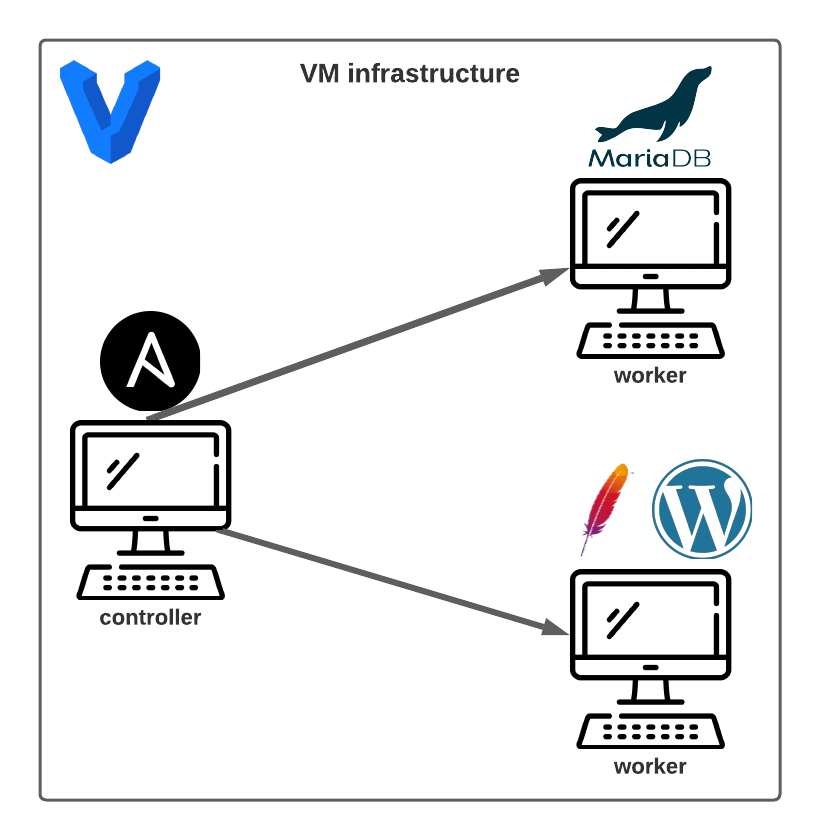

# Hello Ansible

## Wordpress started with ONE command

Project to practice Ansible configuration where I configure a VM with Wordpress and another with MariaDB.



### Execution
1. Clone this repository
```
git clone https://github.com/vitor-msp/hello-ansible.git
```

2. Access the downloaded folder
```
cd hello-ansible
```

3. Starts and provisions the vagrant environment
```
vagrant up
```

### Notes

1. The port 8080 in your machine must be free